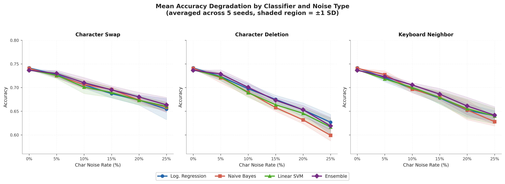
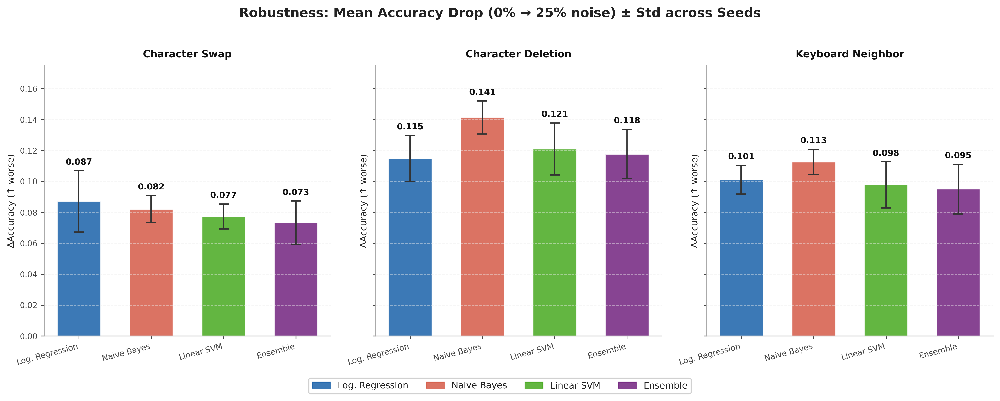
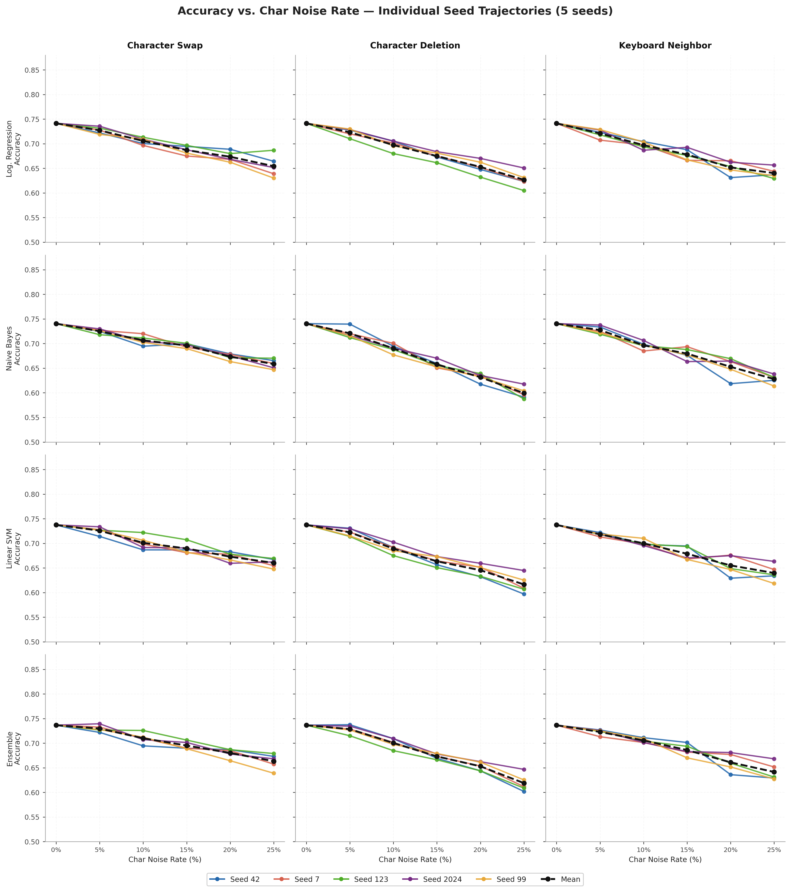
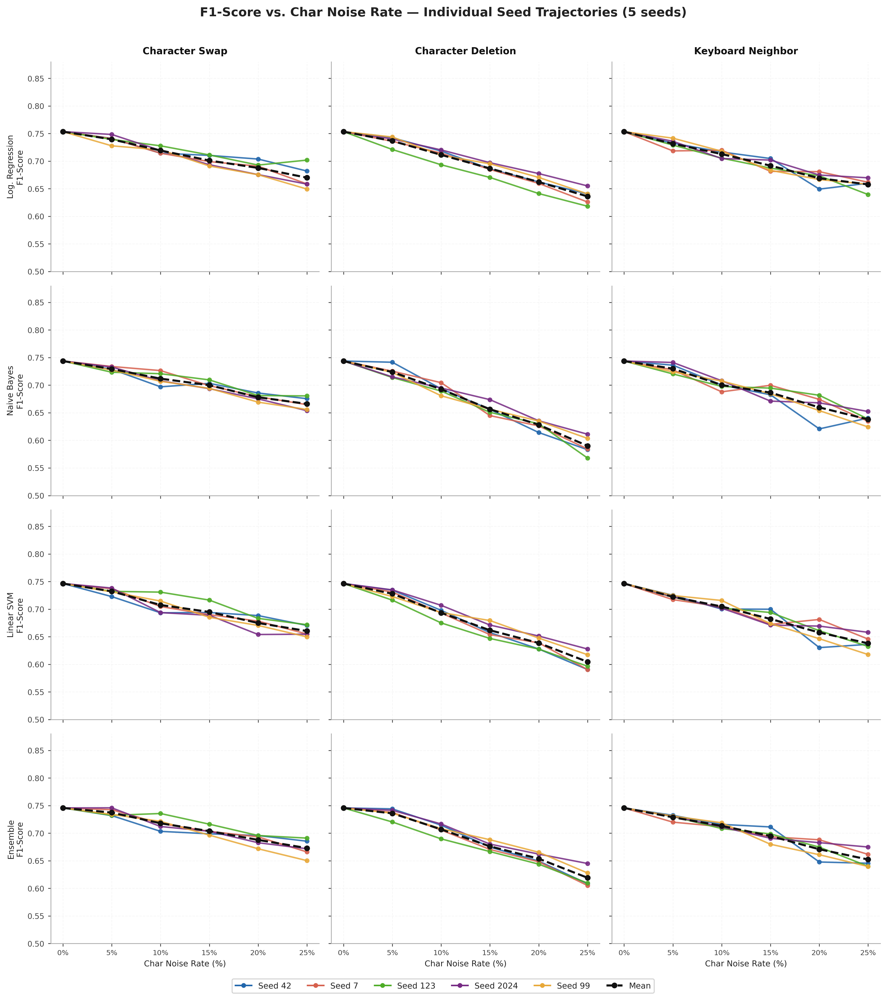
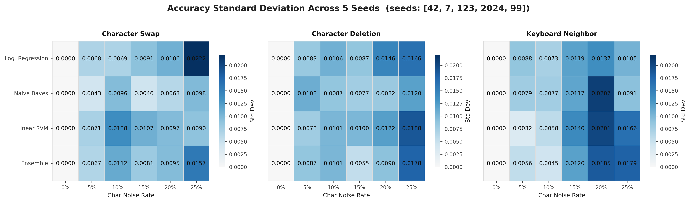
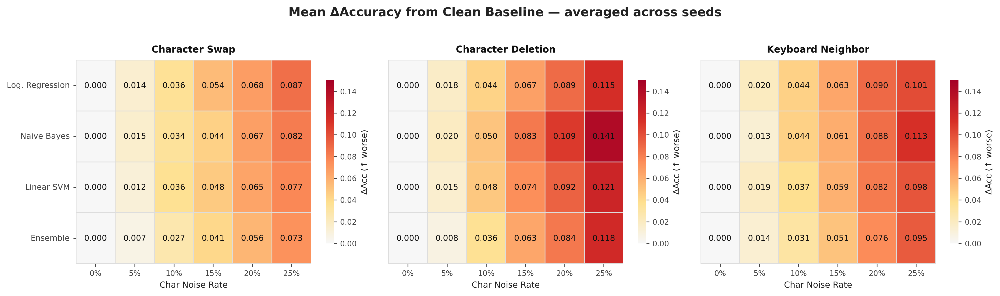

# Classifier Robustness to Character-Level Noise (SST-2)

A comparative study of four classical text classifiers (Logistic Regression (LR),
Multinomial Naive Bayes (MNB), Linear SVM, and a hard-voting Ensemble of the three)
under character-level noise (swap, deletion, keyboard-neighbour substitution) on the
Stanford Sentiment Treebank (SST-2) binary sentiment task.

Full writeup: [`final_report.pdf`](final_report.pdf) / [`final_report.tex`](final_report.tex).

**TL;DR:** all models degrade monotonically as noise increases; character deletion
hurts the most (it produces out-of-vocabulary tokens under TF-IDF); MNB is by far
the most fragile classifier; and the hard-voting ensemble's edge over plain LR is
within one standard deviation across seeds, i.e. not statistically meaningful.

## Results

**Mean accuracy degradation, all classifiers overlaid per noise type (±1 SD bands):**



**Mean accuracy drop from 0% → 25% noise, per model and noise type (±1 SD):**



Additional diagnostic plots (per-seed spread, variance, and delta heatmaps):

| | |
|---|---|
|  |  |
|  |  |

## Method

- **Dataset:** SST-2 (`sentiment-treebank-master/binary`), PTB-tree formatted. Training
  uses every labeled sub-phrase in the train trees (~67k examples); evaluation uses only
  full-sentence roots of the test trees (~1,821 examples).
- **Features:** TF-IDF, unigrams + bigrams, sublinear TF scaling, `max_df=0.95`. The
  vectorizer is fit once on clean training text and reused unchanged for every noisy
  evaluation, so no noisy-test information leaks into the vocabulary.
- **Noise:** three character-level corruption functions, applied independently per
  character within each word at intensities `p ∈ {5%, 10%, 15%, 20%, 25%}`:
  - **swap**: transpose two adjacent characters
  - **deletion**: drop a character
  - **keyboard**: substitute a QWERTY-adjacent key
- **Models:** all four are trained once per seed on clean data and evaluated, without
  retraining, against every noisy test variant. Five seeds (`42, 7, 123, 2024, 99`) are
  used to measure run-to-run stability.
- **Metrics:** accuracy, macro-F1, and ΔAcc (accuracy drop from the 0%-noise baseline),
  plus paired t-tests across the 15 non-zero noise conditions to check significance
  between models.

## Repository layout

```
src/
  sst_data.py     PTB-tree parser + phrase/sentence-level dataset builders
  noise.py        char_swap / char_delete / keyboard_neighbor noise functions
  experiment.py   trains all models, runs the noise sweep, writes outputs/*.csv
  plots.py        renders 05_robustness_drop.png and 06_mean_degradation.png
sentiment-treebank-master/   SST-2 data (PTB-tree format, binary + fiveclass splits)
final_report.tex / .pdf      full paper
references.bib               bibliography
*.png                        result figures (referenced above and in the paper)
```

## Reproducing

```bash
python -m venv venv
venv\Scripts\Activate.ps1        # or `source venv/bin/activate` on macOS/Linux
pip install -r requirements.txt

python -m src.experiment         # writes outputs/results.csv and outputs/tables/*.csv
python -m src.plots              # writes outputs/figures/05_*.png and 06_*.png
```

`experiment.py` is the source of truth for every number in the paper's tables;
`plots.py` regenerates the two figures embedded in the paper from `outputs/results.csv`.
